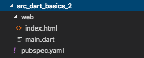

# Dart的Web应用

这个题目起的比较宽泛，Web应用又分前端/前端服务器/后端服务器，好消息是Dart是一个比较完备的语言，其语言能力可以胜任这些功能的实现，更好的是，dart sdk就提供可以实现这些的基础功能，并且也有可靠的前端/后台框架可以选择。简言之，dart完全可以做全栈。

这一章我们不用其他框架，只用dart sdk自带的功能库，来建一个可交互的网页和一个能响应的后台。

## 前置准备

我们需要webdev工具。

``` bash
pub global activate webdev
```

我们的html页面应用都是需要浏览器(内核)来解释运行的，google没法让除了Chrome之外的浏览器都支持dart，所以dart在release时会转成功能相等的javascript的脚本。在开发调试中，为了做到随改随见，又需要在dart vm环境上操作。这些转换就需要webdev。

## 一个简单的交互页面

首先说一下dart web app（后面简称为app）的结构，它的入口实在web文件夹下的main.dart文件中的main()函数，其指向的是web文件夹下的index.html文件。其结构如下图所示，这几个文件(夹)的名字不能更换。



那么这个app需要哪些依赖库呢，我们看一下pubspec.yaml文件。里面比前一篇中多出来dev_dependencies，这块是在开发调试时需要的依赖库，在编译release版本时是不包含进去的。里面的build_runner和build_web_compilers就是我们在调试运行时生成脚本所需要的库了。

``` yaml
name: dart_web_simple

environment:
  sdk: '>=2.1.0 <3.0.0'

dev_dependencies:
  build_runner: ^1.1.2
  build_web_compilers: ^1.0.0
```

### First edition

我们可以做什么呢？第一个版本简单一点，我们的页面是这样的(index.html)，其中head中的script指向的就是main.dart转成js之后的文件。结构非常简单，就是一个id为my-title的元素。

``` html
<!DOCTYPE html>
<html>
<head>
    <script defer src="main.dart.js"></script>
</head>

<body>
    <h1 id="my-title">Hello Dart Web App</h1>
</body>
</html>
```

我们来做点什么吧，比如在3s之后更改一下标题内容(main.dart)：

``` dart
import 'dart:html';

void main() {
  Future.delayed(Duration(seconds: 3), () {
    querySelector("#my-title").text = "I changed title from the code!";
  });
}
```

怎么运行呢？在pubspec.ymal所在的文件夹下，1. 使用*pub get*下载需要的依赖库，2.使用*webdev serve*命令，会在本地起一个服务，挂在8080端口，你就可以通过浏览器访问localhost:8080来访问app了。

3，2，1，标题内容就变了。这里用了dart sdk中的html库，里面的querySelector方法类似于jQurey中的选择元素，这样就可以绑定html文件中的特定元素，然后修改它们的属性了。

我觉得3s时间太长/短，我觉得标题要更风骚一些怎么办？记得刚刚使用的*web serve*吗，只要你不终止它，它是一直在运行的，更改代码后保存，这时应该能看到terminal下出现：看到Succeeded之后刷新浏览器就可以看到修改过后的代码运行了。

```
[INFO] Starting Build
[INFO] Updating asset graph completed, took 5ms
[INFO] Running build completed, took 221ms
[INFO] Caching finalized dependency graph completed, took 137ms
[INFO] Succeeded after 368ms with 6 outputs (4 actions)
```

### Second Edition

dart只能改改