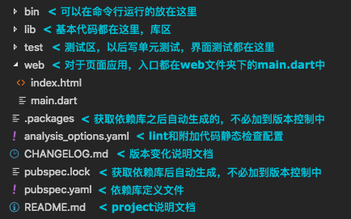

# Dart Angular 之一

好了，现在你应该知道：

1. 如何使用代码和用户交互；
2. 如何使用代码操纵html页面；
3. 如何处理根据API文档发送/处理http req/resp；
4. plus 如何构建自己的简单http server；

既然你已了解了dart web的基础，那么你应该可以完成一个功能如同[Google Ads](https://ads.google.com/intl/en_us/home/?subid=us-en-et-g-aw-a-home-awhp_awx!o2m--ahpm-0000000014-0000000000)的网站了吧。

emmm...理论上来说，知道了1+1=2就了解了数学的本质。可是若是要推导高阶函数收敛极值所在，还是需要使用微积分公式，follow一个规则，完全明白它是如何得来如何实现的最好，但在无法完全理解的情况下，信任这种规则的结论也是必要的。

在前两篇中提到的是基础，但若是使用它们来搭建稍微复杂一点的场景就会有功能模块不好划分，页面结构复杂不好维护等问题。所以，我们需要一个框架，这里我选了**Angular**。

## dart应用文件结构惯例

一个dart应用的文件结构是有惯例的，[官方文档](https://www.dartlang.org/tools/pub/package-layout)中有详细说明，这里我写写我们用得到的。

## 一个使用Angular的简单应用

Angular框架提供了便利与可行的模块化开发，这里我们写一个简易的