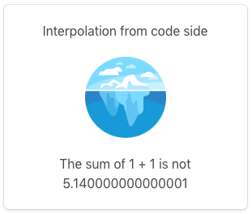
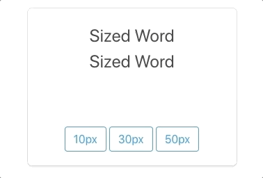
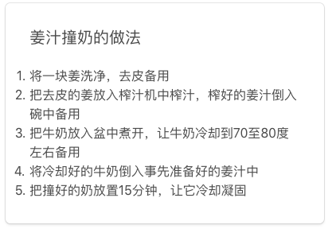
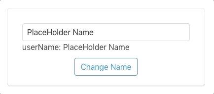

# Angular常用操作

个人对事物的认识方式都很不一样，我倾向于先体验一下是怎么回事，再来看原理，之后再体验，这个loop重复个几回，对这个事物就能有个可用的认识了。

所以这一篇我来总结一下Angular中的基础功能，知道这些之后，即使你对Angular还是一头雾水，也可以写出一个可用的交互页面啦。我们先把Angular运作起来，再对照着文档来理解它们的设计概念，以及构架原理。

这一篇是基于[官方文档 CheatSheet](https://webdev.dartlang.org/angular/cheatsheet)一章，并举了一些例子。

## html中的模版语法

一开始我认为是编写html应用时选择了Angular，所以Angular中使用html作为它的视图结构是必然，后来发现是angular使用一定规则生成了一个标准的html+css+js形式，而在开发中使用html只是Angular的一个选择。

实际上，在Angular中当作模版使用的html也并不是标准的html，直接拿到浏览器上是要报错的，但它们之间的这种差别也没有那么大。html中的大多数元素都可以在Angular中使用，但也不是全部，例如`<script>`，由于安全原因，这在angular模版中是被禁止的。

所以可以说，在angular中使用的html是一个有增有减的特制版本，在这种定制化的html语言中，我们可以用特定的关键字/语法格式来将数据和视图绑定起来。

### 插值 Interpolation {{…}}

用双大括号包裹起来的部分，会插入这部分的计算值，可以是一个变量名称，也可以是一个表达式。使用位置可以是元素的text，也可以是属性的值。
``` dart
@Component(
  ...
  template: ''' 
  <div>{{fromInterpolation}}</div>
  
  <p>The sum of 1 + 1 is not {{1 + 1 + getVal()}}</p>
  ''',
)
class SyntaxPlay {
  String fromInterpolation = "Interpolation from code side";
  String fromInterpolationUrl = "assets/iceburg.png";
  num getVal() { return 3.14; }
}
```
显示出来就是：



### 绑定 Bind-In [...] bind-

方括号内是这个元素的某个属性，等号之后是赋值的表达式，以下这两种写法，效果是等同的：

``` html
<p [style.font-size.px]="mySize">Sized Word</p>
<p bind-style.font-size.px="mySize">Sized Word</p>
```
运行时，bind的属性会接收mySize中的值，赋予style.font-size.px，效果如图。



### 绑定 On-Action (...) on-

小括号内是接收的属性/响应类型，等号之后就是处理它的函数，以下两种写法，效果是等同的：

``` html
<button (click)="doSomething()">Save</button>
<button on-click="doSomething()">Save</button>
```

上面更改字体大小的三个按钮的响应就是这样写的：
``` html
<button (click)="mySize = 10">10px</button>
<button (click)="mySize = 30">30px</button>
<button (click)="mySize = 50">50px</button>
```

### Angular中的自带指令 NgIf NgFor NgSwitch NgClass

使用这些指令前，需要在component的directives中声明。

``` dart
@Component(
    ...
    directives: [NgIf, NgFor, NgSwitch, NgClass]
)
```

`NgIf`之后跟着一个返回布尔值的表达式，用于决定是否在当前页面保留这个元素。当值为`false`时，会从dom tree中移除这个元素，这和hidden是不一样的。使用时需要在之前加一个星号。

``` html
<p *ngIf="randomBool()">我是薛定谔的段落</p>
```

`NgFor`之后会跟着一个固定格式的句子，用来遍历一个集合，并将集合中的每一个元素用于增加一个相应的视图元素。使用时需要在之前加一个星号。

``` html
<div>姜汁撞奶的做法</div>
    <ol>
      <li *ngFor="let step of steps">{{step}}</li>
    </ol>
</div>
```
``` dart
// 在定义此component的dart文件中有一个名为steps的可遍历的变量
List<String> steps = [...];
```


`NgSwitch`的用法稍微复杂一点，它是`NgSwitch`，`NgSwitchCase`以及`NgSwitchDefault`这三个指令的组合，用于根据条件显示某一种component。我一时还没想到合适的场景，我们就来看一下示例，看个意思。写过switch语句的，对于这个就比较好理解了，通过`currentHero.emotion`这个变量的值来与`ngSwitchCase`中的值比对，看显示哪一个tag，若是都比对不上，则显示`ngSwitchDefault`标注的tag。

``` html
<div [ngSwitch]="currentHero.emotion">
  <happy-hero    *ngSwitchCase="'happy'"    [hero]="currentHero"></happy-hero>
  <sad-hero      *ngSwitchCase="'sad'"      [hero]="currentHero"></sad-hero>
  <confused-hero *ngSwitchCase="'confused'" [hero]="currentHero"></confused-hero>
  <unknown-hero  *ngSwitchDefault           [hero]="currentHero"></unknown-hero>
</div>
```

`NgClass`用于通过一组形如{className: true/false}的Map值，动态更改该元素的css类，从而根据不同状态更改元素的外观。以下为例，

``` html
<div [ngClass]="{active: isActive, disabled: isDisabled}"></div>
```
`关联的css文件中`
``` css
.active {...}
.disabled {...}
```
`对应的dart类中`
``` dart
bool isActive = true; // isActive为真时会使用css中的active中样式修饰
bool isDisabled = false;
```

### 双向绑定 NgModel [(ngModel)]

Angular中针对Form有一套对应的指令集，比如绑定，validate，error handling等等，它们也完全可以在代码中自行控制。这里只介绍Form指令中的双向绑定。

`ngModel`与上面提到的4个指令类似，也是一个build-in指令，但它是在angular_form库中定义的，所以需要在`pubspec.yaml`中添加`angular_form`的依赖，然后在dart文件中import相应类，并在directives中声明。

`pubspec.yaml`
``` yaml
 dependencies:
    angular_forms: ^2.1.2
```
`模版html文件`
``` html
<input type="text" [(ngModel)]="userName">
<!-- next part is for test -->
<p>userName: {{userName}}</p>
<button (click)="changeUserName()">Change Name</button>
```
`dart class`
``` dart
import 'package:angular_forms/angular_forms.dart';
@Component (
    ...
    directives: [formDeirectives]
)
class WhateverName {
    String userName = "PlaceHolder Name";
    void changeUserName() {
        userName = "Changed!";
    }
}
```
可以看到，当代码中的userName值有变化时，会更新到input框中，同样input改变的值也会改变userName的值，这就是双向绑定了。



至此，Angular中最基本的操作应该都有所了解了。反正我当时的感觉是，不问究竟的话，我可以用它来实现任何功能（并不）！

## 课后练习

把它们自己实现一遍～